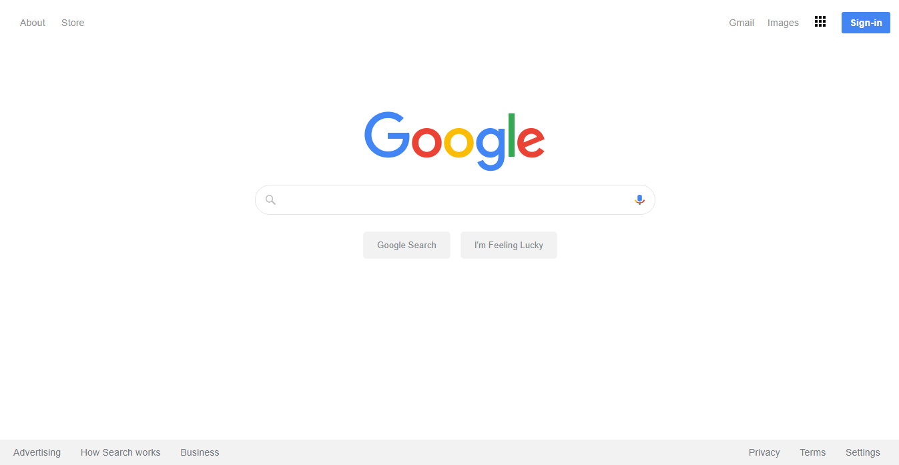

# My implementation for Project HTML/CSS at the Odin Project - Cloning the layout of Google's Search Page
This is an implementation of the 'easy' version, Clone of the look of the Google Search Page.

**Details:**(https://www.theodinproject.com/courses/web-development-101/lessons/html-css)

**Here's a snapshot of the Google Search Page I built

